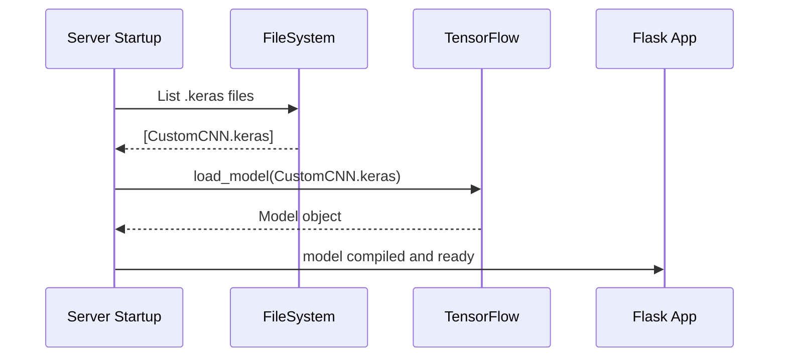
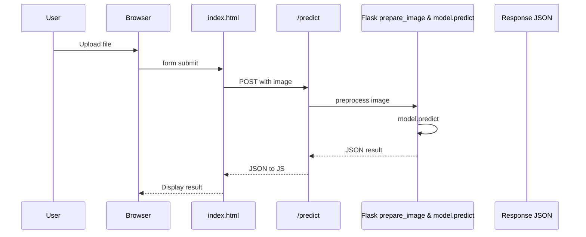

# Malaria Detection Feature Documentation

## Overview

The Malaria Detection feature provides a web interface and REST API to classify blood smear cell images as **Parasitized** or **Uninfected** using a pretrained CNN model. Users can upload an image through a drag-and-drop UI and receive an instant prediction with confidence scores. The feature bridges a Jupyter notebook training pipeline with a Flask backend and a responsive HTML/CSS/JS front end.

This solution streamlines malaria screening by enabling rapid, client-side image uploads and server-side inference. It fits into the application by exposing model artifacts generated in the `malaria.ipynb` notebook, loading them in `app.py`, and rendering results via `templates/index.html`.

## Architecture Overview

```mermaid
flowchart TB
  subgraph Data Processing Notebook
    Notebook[malaria.ipynb]
    Notebook -->|Exports .keras| ModelFile[(.keras Model)]
  end

  subgraph Server Application
    App[app.py Flask App]
    ModelFile --> App
    App -->|Renders| Template[index.html]
    App -->|POST /predict| PredictAPI[/predict]
    App -->|GET /health| HealthAPI[/health]
    App -->|GET /.well-known/...| DevToolsAPI[/.well-known/appspecific/com.chrome.devtools.json]
  end

  subgraph Client Browser
    Browser[User Browser]
    Browser -->|GET /| Template
    Template -->|POST /predict| PredictAPI
    PredictAPI -->|JSON| Template
  end
```

## Component Structure

### 1. Presentation Layer

#### **Index Page** (`templates/index.html`)
- **Purpose and responsibilities**  
  - Renders the main UI for image upload and result display.  
  - Provides a drag-and-drop zone and file input fallback.  
- **Key Elements**  
  - `<header>` with logo and model status badge.  
  - `<section class="hero">` with feature tag and description.  
  - `<form id="uploadForm">` managing file selection.  
  - `<div id="results">` displaying prediction, confidence, and download buttons.  
- **Client-Side Scripts**  
  - Handles form submission via `fetch` to `/predict`.  
  - Parses JSON response and updates DOM elements.  
  - Error handling and toast notifications.  

#### **Flask Routes** (`app.py`)
- **Purpose and responsibilities**  
  - Serve the HTML UI and handle API requests for prediction and health checks.  
  - Load, compile, and manage the TensorFlow/Keras model.  
- **Key Route Functions**  
  - `home()` – Serves `index.html` with model status.  
  - `predict()` – Accepts an image file, preprocesses, runs inference, and returns JSON.  
  - `health()` – Returns service status and model load state as JSON.  
  - `chrome_devtools()` – Silences Chrome DevTools 404 noise with a 204 response.  

### 2. Business Layer

#### **Model Service** (`app.py`)
- **Purpose**  
  - Dynamically discover and load a `.keras` model from the working directory.  
  - Compile with `adam` optimizer and `binary_crossentropy` loss.  
- **Key Functions**  
  - **Load model block**  
    ```python
    import tensorflow as tf
    keras_files = [f for f in os.listdir('.') if f.endswith('.keras')]
    model = tf.keras.models.load_model(keras_files[0], compile=False)
    model.compile(optimizer='adam', loss='binary_crossentropy', metrics=['accuracy'])
    ```
  - **prepare_image(file: FileStorage) → np.ndarray**  
    - Opens image, converts to RGB, resizes to `model.input_shape`, normalizes to [0,1], and returns a batch of shape `(1, H, W, 3)`.

### 3. Data Access Layer

#### **File Handling** (`app.py`)
- **Upload constraints**  
  - Configured max request size: `16 * 1024 * 1024` bytes.  
- **Storage**  
  - Creates `static/uploads` on startup (though upload files are processed in memory, not persisted long-term).

## Data Models

#### **PredictionResponse**
| Property                 | Type    | Description                                              |
|--------------------------|---------|----------------------------------------------------------|
| success                  | boolean | Indicates if inference succeeded                         |
| prediction               | string  | `"Parasitized"` or `"Uninfected"`                        |
| confidence               | number  | Confidence percentage of the predicted class             |
| parasitized_probability  | number  | Confidence percentage for `"Parasitized"`                |
| uninfected_probability   | number  | Confidence percentage for `"Uninfected"`                 |
| timestamp                | string  | Inference completion time in `YYYY-MM-DD HH:MM:SS`       |
| error (optional)         | string  | Error message if `success` is `false`                    |

## API Integration

### Home Page

```api
{
    "title": "Home Page",
    "description": "Serves the main UI for MalariaAI cell detection",
    "method": "GET",
    "baseUrl": "http://127.0.0.1:5000",
    "endpoint": "/",
    "headers": [],
    "queryParams": [],
    "pathParams": [],
    "bodyType": "none",
    "responses": {
        "200": {
            "description": "Renders index.html UI"
        }
    }
}
```

### Predict Image

```api
{
    "title": "Predict Cell Image",
    "description": "Classifies an uploaded blood smear cell image",
    "method": "POST",
    "baseUrl": "http://127.0.0.1:5000",
    "endpoint": "/predict",
    "headers": [
        { "key": "Content-Type", "value": "multipart/form-data", "required": true }
    ],
    "queryParams": [],
    "pathParams": [],
    "bodyType": "form",
    "formData": [
        { "key": "file", "value": "Image file (PNG/JPG)", "required": true }
    ],
    "responses": {
        "200": {
            "description": "Inference result",
            "body": "{\n  \"success\": true,\n  \"prediction\": \"Parasitized\",\n  \"confidence\": 92.45,\n  \"parasitized_probability\": 92.45,\n  \"uninfected_probability\": 7.55,\n  \"timestamp\": \"2026-03-09 14:22:17\"\n}"
        },
        "400": {
            "description": "Client error (no file or empty filename)",
            "body": "{\n  \"success\": false,\n  \"error\": \"No file received by server.\"\n}"
        },
        "500": {
            "description": "Server error (model load or preprocess failure)",
            "body": "{\n  \"success\": false,\n  \"error\": \"Model not loaded. Check that a .keras file is present.\"\n}"
        }
    }
}
```

### Health Check

```api
{
    "title": "Health Check",
    "description": "Returns service status and model load state",
    "method": "GET",
    "baseUrl": "http://127.0.0.1:5000",
    "endpoint": "/health",
    "headers": [],
    "queryParams": [],
    "pathParams": [],
    "bodyType": "none",
    "responses": {
        "200": {
            "description": "Service health status",
            "body": "{\n  \"status\": \"running\",\n  \"model_loaded\": true,\n  \"model_error\": null\n}"
        }
    }
}
```

### Chrome DevTools Silence

```api
{
    "title": "Chrome DevTools Silence",
    "description": "Suppresses DevTools requests noise",
    "method": "GET",
    "baseUrl": "http://127.0.0.1:5000",
    "endpoint": "/.well-known/appspecific/com.chrome.devtools.json",
    "headers": [],
    "queryParams": [],
    "pathParams": [],
    "bodyType": "none",
    "responses": {
        "204": {
            "description": "No Content"
        }
    }
}
```

## Feature Flows

### 1. Model Loading Flow



### 2. Prediction Flow



## State Management

- **Model State**:  
  - `model` variable is `None` until a `.keras` file is loaded.  
  - `MODEL_ERROR` captures import or load failures.

## Integration Points

- **`malaria.ipynb` → `.keras` files**: Notebook phases generate model artifacts used by the Flask app.  
- **Flask App → templates/index.html**: Renders UI and injects `model_loaded` and `error` flags.

## Key Classes & Functions Reference

| Component               | Location            | Responsibility                                   |
|-------------------------|---------------------|--------------------------------------------------|
| prepare_image           | app.py              | Preprocesses uploaded image for model inference  |
| load model block        | app.py              | Discovers and loads `.keras` model file          |
| home                    | app.py              | Serves main UI                                   |
| predict                 | app.py              | Handles inference requests                       |
| health                  | app.py              | Provides health check                           |
| chrome_devtools         | app.py              | Silences Chrome DevTools noise                  |
| index.html template     | templates/index.html| UI layout, file upload, result rendering        |
| Notebook phases         | malaria.ipynb       | Data prep, model building, training, exporting  |

## Error Handling

- Validates presence and non-empty filename of uploaded file.  
- Returns HTTP 400 for client errors and HTTP 500 for server/model errors.  
- Logs errors to console for debugging.

## Dependencies

- Flask 3.1.3  
- TensorFlow 2.21.0  
- Keras 3.13.2  
- NumPy 2.4.2  
- Pillow 12.1.1  
- h5py 3.14.0  

_(See `requirements.txt` for full list)_

## Testing Considerations

- Upload valid PNG/JPG and verify correct classification.  
- Submit without a file to confirm 400 error.  
- Corrupt or non-image file to ensure 500 error handling.  
- Remove `.keras` file to observe model load error on startup.  
- Health endpoint should always return status and model state.